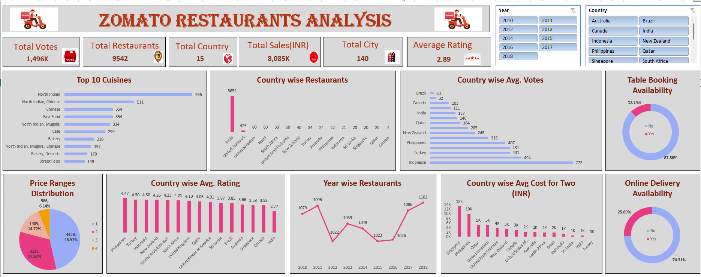

# Zomato Restaurant Analysis

## 📌 Overview
This project analyzes restaurant data from Zomato to uncover insights on market trends, customer preferences, pricing strategies, online delivery impact, and opportunities for expansion. The goal is to assist in strategic decision-making for new restaurant openings.

## 📊 Data Sources
- *Excel Dataset* – Contains restaurant details, customer votes, cuisine types, and pricing data.
- *Analysis Report* – SQL and Excel-based calculations answering key business questions.
- *Presentation (PPTX)* – Summarized insights, trends, and strategic recommendations.

## 🔍 Key Analyses and Insights

### 🛠 Data Cleaning & Processing
- Dropped unnecessary columns (Address) to enhance data efficiency.
- Removed duplicate records and handled missing values.
- Standardized currency and formatted date fields for better analysis.

### 🌍 Restaurant Market Distribution
- *India has the highest number of restaurants (8652), followed by the USA (425) and the UK (80).*
- *Low-competition markets:* Canada, Qatar, Sri Lanka, Singapore, and Indonesia offer strong expansion opportunities.

### 👥 Customer Engagement
- *Indonesia leads in customer engagement* with *772 average votes per restaurant*.
- *UAE, Turkey, and the Philippines* also show strong customer interaction.
- *Brazil and Singapore* have lower engagement, requiring better marketing strategies.

### 📅 Restaurant Openings Over Time
- *Peak Year:* 2018 (1,102 restaurant openings).
- *Lowest Year:* 2012, possibly due to economic downturns.
- *Overall Growth:* A steady upward trend from 2015 to 2018.

### 🚀 Online Delivery & Table Booking Trends
- *Online delivery boosts restaurant ratings* (3.29 for delivery vs. 2.75 for non-delivery).
- *Table booking has an even greater impact* (3.48 vs. 2.81) but is *only available in 12.14% of restaurants*.
- *Potential Growth:* Expanding these features can improve customer satisfaction.

### 💰 Price Range Analysis
- *Most restaurants fall into low-to-mid price ranges (₹0-₹1000).*
- *Premium restaurants (₹10,000 - ₹45,000) are rare*, offering an untapped high-end market opportunity.

### 🍽️ Cuisine Performance
- *Best-rated cuisines:* Italian (3.73), Bakery/Desserts/Fast Food (3.40), Chinese/Thai (3.37).
- *Lowest-rated cuisines:* Biryani (1.97), Mughlai (2.10), North Indian (2.15).
- *Conclusion:* High-rated cuisines improve customer satisfaction.

### 📌 High-Potential Expansion Locations
#### *Best Cities for New Restaurants*
- *Canada:* Chatham-Kent, Consort, Vineland Station, Yorkton (low competition, high potential).
- *Qatar, Singapore, Sri Lanka:* Moderate competition but promising market growth.
- *Indonesia:* Bandung, Bogor, Tangerang, Jakarta – strong demand and room for growth.

### 💲 Financial Considerations
- *Highest food expenditure:* Singapore, requiring higher financial investment.
- *Lower-cost markets:* Canada and Sri Lanka, offering budget-friendly expansion opportunities.
- *Moderate-cost market:* Qatar, balancing affordability and profitability.

## 📌 Recommendations
✅ *Expand in Low-Competition Markets* – Prioritize Canada, Sri Lanka, and Qatar.  
✅ *Leverage Online Delivery Services* – Increase accessibility and customer reach.  
✅ *Introduce Table Booking* – Enhance ratings and engagement.  
✅ *Offer High-Performing Cuisines* – Focus on Italian, Bakery, and Chinese.  
✅ *Optimize Pricing Strategy* – Mid-range pricing has the highest demand, but premium expansion is an opportunity.  

## 📊 Dashboard & Visualizations
### *Dashboard Preview*

- Includes *Year-wise and country-wise filters* for dynamic insights.
- Visualizes *restaurant distribution, price segmentation, customer engagement, and ratings*.

## 🛠 Tools Used
- *Excel* – Data cleaning, analysis, and visualization.
- *Pivot Tables & Charts* – Dynamic insights into restaurant trends.
- *PowerPoint* – Presenting insights in a structured format.

## 🎯 How to Use This Project
1. *Run the Excel-based analysis* – Use pivot tables to explore trends.  
2. *Refer to dashboard visualizations* – Adjust filters for deeper insights.  
3. *Implement recommendations* – Optimize restaurant strategies based on insights.  

## 🔚 Conclusion
This project provides a *data-driven approach to restaurant market analysis, helping businesses identify opportunities, optimize pricing, and improve customer engagement. By targeting **low-competition markets, expanding **online delivery and table booking, and leveraging **high-rated cuisines*, Zomato can enhance its restaurant portfolio and customer reach effectively.

---

💡 For more details, refer to the presentation and dataset files. 🚀
